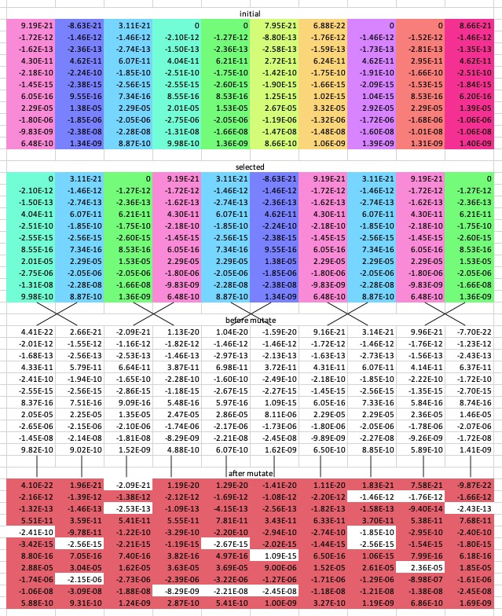
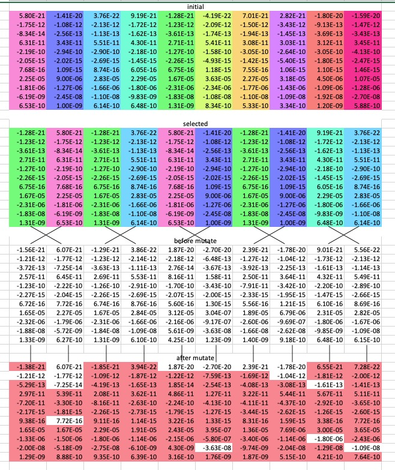
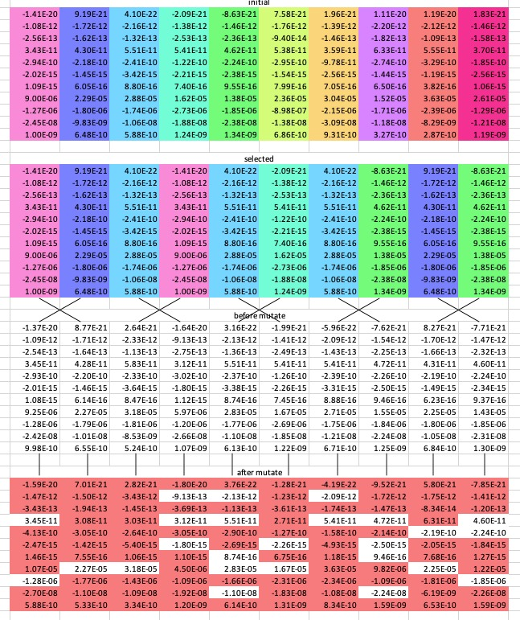

# REPORT - Project on Genetic Algorithms  

### Team - dunder mifflin

Saravanan Senthil (2019101016), Abhijeeth Singam(2019101065)

## Introduction

The project revolved around using the genetic algorithm to find a vector of weights that performs well on a hidden dataset. This report will explain the logic behind it and explain some of the code.


How to run:

```python
python3 main.py
```


## Overview of Genetic Algorithm

```python
def newGeneration(oldgen):
    
    for i in oldgen.popList[:conf.BREEDING_POOL_SIZE]:
        total_error += i.error

    probs = []

   
    childGenesList = []

    while len(childGenesList) < conf.POPULATION_SIZE:
       
        indsToMate = np.random.choice(
            np.arange(0, conf.BREEDING_POOL_SIZE), 2, replace=False, p=probs)

        print("Selected mates: " + str(indsToMate))

        child1Genes, child2Genes = crossover(
            oldgen.popList[indsToMate[0]], oldgen.popList[indsToMate[1]])

				# on creation of individual object mutation takes place
        childGenesList.append(Individual(child1Genes))
        childGenesList.append(Individual(child2Genes))

        # childGenesList.append(child1Genes)

    bestofBothGenerations = oldgen.popList[:
                                           conf.NUM_PARENTS_PASSDOWN] + childGenesList
    bestofBothGenerations.sort(key=lambda x: x.error)

    utils.appendToSubmissionFile(toSubmit)

    return Population(bestofBothGenerations[0:conf.POPULATION_SIZE],
                      oldgen.genNumber + 1)

```

This function is called at the creation of each new generation, and predictably involves:

- selection
- crossover
- mutation

## Fitness function

In our genetic algorithm, we aimed to decrease the error of the vectors which was calculated as a combination of the train and validation errors. To this end, we didn't use any explicit fitness function, but rather related low error to high fitness. The given vector was overfit to the training data and thus performed far better on the training set than it did on the validation set.

### Attempt 1
```python
train + val
```

This worked well initially and enabled us to decrease the magnitudes of the train and validation errors, but after running this for an extended, we simply ended up with a vector that was overfit on train and validation together and performed terribly on the test set. 

### Attempt 2

```python
train**2 + val**2
```

We attempted to use this error function so that we could effectively penalise vectors that had drastically different errors on train and val, and in turn promote vectors with similar train and val errors while also giving importance to the magnitude of the errors. This unfortunately didn't work and failed to make any significant improvements.

### Attempt 3

```python
(train - val)**2 * (train + val)**3
and
ERR_FACTOR * abs(train - val) + train + val
```

These were failed attempts to reduce both the difference and the magnitude of the errors simultaneously. We attempted to reduce the difference so that it would perform similarly across the two sets and possible the test set as well. Achieving such consistency would mean that it would likely perform just as well on most other sets.

### Attempt 4

```python
ERR_FACTOR * train + val
and
train + val
```

This was our successful attempt to find well-performing vectors. It is very similar to attempt 1 but gave much better results due to changes in the hyper-parameters and much stricter supervision from our side.

We started out with 'ERR_FACTOR * train + val' as the given vector was overfit to the training set and thus had a much lower error on the training set. By using this, we were able to bring the training and validation errors to comparable levels.

After we had accomplished that, we then switched to 'train + val' so as to reduce the total error of the vectors. This fared differently from our first attempt due to two main reasons:

1. We changed the hyper-parameters:

   ​	In this attempt, we made the population size smaller and made the mutation probability slightly smaller as well.

2. We became helicopter parents:

   ​	We started strictly monitoring the errors of the vectors in the subsequent generations. We continuously changed the number of parents selected for crossover accordingly to select parents with potential. This allowed us to continuously get good performing vectors. This also allowed to immediately find the point at which the generations started overfitting and allowed us to roll back those generations.

## Selection Logic

- Sort population by fitness
- Take best conf.BREEDING_POOL_SIZE out of those
- Select 2 parents repeatedly based on their fitnesses
- Pass down the best conf.NUM_PARENTS_PASSDOWN parents


##  Crossover Function

### Attempt 1

- Take 2 parents and copy the vectors as child1 and child2,
- Select 5 random indices,
- Switch the values of the children till that index,

Code:
``` python
def crossoverOld(par1, par2):
    # simply exchanging random genes
    child1Genes = par1.genes.copy()
    child2Genes = par2.genes.copy()
    randPrefix = random.randint(0, 11)
    indList = np.arange(0, randPrefix)
    # indList = np.random.choice(np.arange(0, 11), 5, replace=False)
    for index in indList:
        child1Genes[index], child2Genes[index] = child2Genes[
            index], child2Genes[index]

    return child1Genes, child2Genes
```

### Attempt 2 (Simulated Binary Crossover)

We switched to this crossover function to have fine-tuned control over how much the children vary from the parents (which was absent in the previous attempt) and also have a less restricted outcome for the crossover. Instead of  the children vectors directly inheriting certain genes/weights from the parents, this allows them to have a combination of the genes of the two parents for every single gene.

- Take 2 parents,

- Simulate binary crossover,

Code: 

```python
def crossover(par1, par2):
    # fancy, uses simulated binary crossover... keeps avg same, distributes all genes uniformly

    par1genes = par1.genes.copy()
    par2genes = par2.genes.copy()

    u = random.uniform(0, 1)

    nc = 3

    if u < 0.5:
        beta = (2 * u) ** (1 / (nc + 1))
    else:
        beta = (2 * (1 - u)) ** (-1 / (nc + 1))

    # nc decides how diff child will be from parent
    # beta is the similarity to the parents AKA spread factor

    child1genes = 0.5 * ((1 + beta) * par1genes + (1 - beta) * par2genes)
    child2genes = 0.5 * ((1 - beta) * par1genes + (1 + beta) * par2genes)

    # ensure that weigths are belong to [-10, 10]

    return child1genes, child2genes
```

Parameters to tune: 'nc' (the divergence factor), it was initially set to 2 and later was set to 5 and 10 to produce children similar to the parents.


## Mutation

```python
def mutate(genes):
    mutateProb = conf.MUTATE_PROB
    # numMutate = conf.NUM_MUTATE

    for index in range(11):
        # if it should be mutated or left alone
        if mutateProb >= random.random():
            if genes[index] == 0:
                genes[index] = random.uniform(-1e-20, 1e-20)
            # mutate!
            else:
                genes[index] *= random.uniform(-conf.MUTATE_FACTOR,
                                            conf.MUTATE_FACTOR) + 1
                # make sure weights are btw -10, 10
            genes[index] = min(genes[index], 10.0)
            genes[index] = max(genes[index], -10.0)

    return genes
```

Parameters to tune: 

- mutateProb: the probability that a gene of the vector get mutated

- mutateFactor: the maximum factor by which it mutates each selected weight of the vector


## Statistical information

Number of iterations to converge: we've restarted the algorithm several times, and each time its taken about 300 iterations to converge.

### Hyperparameters:

- Population Size:

  ​	We used many different population sizes throughout the project ranging from 10-30, but the one that we used in the end and gave us the most success was a generation size of 10. With this generation size, we consistently about 2 decent vectors in each generation while also being able to train many generations.

- Mating Pool Size:

  ​	The value of mating pool size was dependent on the population size of a generation, but varied from 1/2 to 7/8 of the population size. In the early stages, we kept the mating pool size high to increase diversity in the population.

- Parents Passed Down:

  ​	The number of parents we passed down to the next generation remained at around 1/5th of the population size. This was done as a safety measure to ensure that the vectors in subsequent generations didn't become significantly worse.

- Mutate Factor and Probability:

  ​	Mutate factor is the maximum ration by which we change any selected gene of a vector. If the mutate factor is 0.5, the gene can be changed to any value between 0.5 and 1.5 times it's initial value. We started out with a mutate factor of 0.7 to create more diversity and move away from the initial overfit. This was later decreased to 0.5, 0.35, and then 0.1 to restrict and reduce the diversity of the children that are produced.

  ​	Mutate probability is the probability that a gene of a vector is selected to be mutated. We initially had a high mutate probability of 0.8 and later decreased this to 0.5 to decrease the number of mutations happening each time.

- Divergence Factor ('nc'):

  ​	The 'divergence factor' is a parameter of the second crossover attempt, the simulated binary crossover. It allows us to control how different the generated children are from their parents. A higher value will result in less diverse children and a lower value will allow for more diversity. It was initially set to 2 and later was set to 5 and 10 to produce children similar to the parents.


## Various Approches

- Starting from overfit: the most successful
- Starting with overfit with some features set to 0: not very successful
- Starting with random vectors: least successful

## Generation Diagrams

In these diagrams, we've coloured the different vectors so that we can track which ones were selected for crossover. We also marked each gene/weight that was mutated in each of the children.

Generation 1:

The initial population for this generation is made up of mutated versions of the given overfit vector.



Generation 2:



Generation 3:



